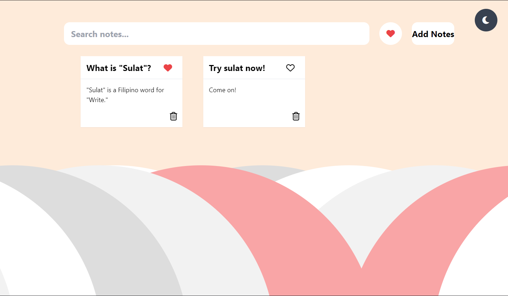

# Notes Application!
View the live application here:  
https://sulat.netlify.app

Tech Stack:  
-React.js  
-JavaScript  
-TailwindCSS  

Screenshot:  
 

Additional learning:
1. Using localStorage to save data for every user

Developer Notes:
1. Dark mode functionality is not from tailwindCSS, I just used ternary operator for setting backgrounds based on state changes
